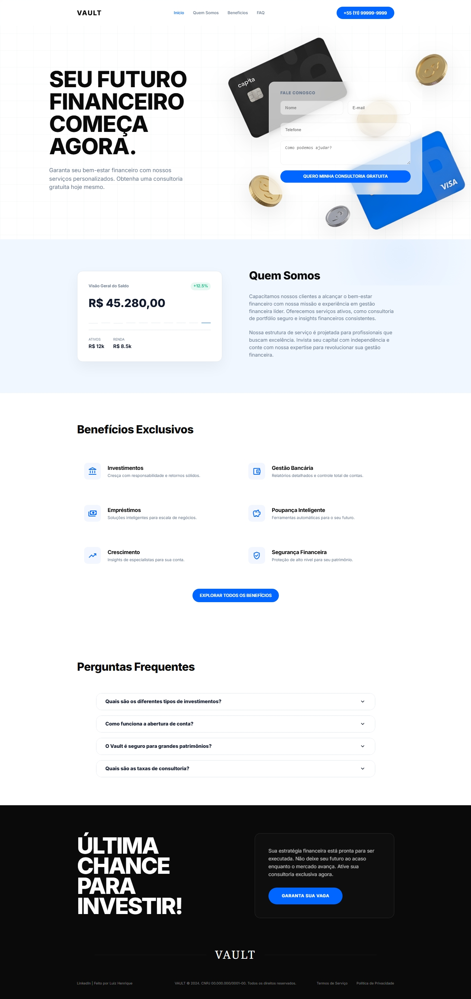

# 🏦 Vault - Landing Page (Teste Front-End)

Landing page desenvolvida para o teste técnico da Ellos Design, focada em responsividade e interface do usuário.

[**Visualizar Projeto Live**](https://vaultfinances.vercel.app/)

---



## 📈 Sobre o Projeto
O Vault é uma interface de gestão financeira que prioriza a usabilidade e o desempenho. O projeto utiliza uma estética sóbria com efeitos de transparência e animações fluidas via JavaScript nativo.

### Funcionalidades:
*   **Dashboard Interativo**: Simulação de ativos e gráficos dinâmicos.
*   **Animações de Scroll**: Uso da Intersection Observer API para efeitos de surgimento de conteúdo.
*   **Scroll Spy**: Menu de navegação que rastreia a posição do usuário na página.
*   **Formulário de Lead**: Sistema de captura com validação de dados.
*   **Responsividade**: Adaptado para diferentes resoluções de tela.

---

## 🛠️ Tecnologias
*   HTML5
*   SASS (SCSS)
*   JavaScript (Vanilla)
*   PHP (PDO)
*   MySQL

---

## 💻 Como Executar
Para rodar o projeto localmente, basta realizar o clone do repositório e abrir o arquivo `index.html` em seu navegador:

```bash
git clone https://github.com/luizzhenrique1/teste-frontend-developer.git
```

### Nota sobre o Back-end
O projeto conta com a lógica PHP e SQL pronta para uso nos arquivos [**`processa.php`**](processa.php) e [**`database.sql`**](database.sql). Por questões de compatibilidade com o deploy estático (Vercel), esta funcionalidade está em espera, sendo simulada via JavaScript no front-end.

---

## 👤 Autor
**Luiz Henrique**

*   [**LinkedIn**](https://www.linkedin.com/in/luiz-henrique-324825200/)
*   [**GitHub**](https://github.com/luizzhenrique1)

Agradeço a oportunidade de realizar este teste e coloco-me à disposição para eventuais dúvidas ou feedbacks sobre a implementação. ✨
